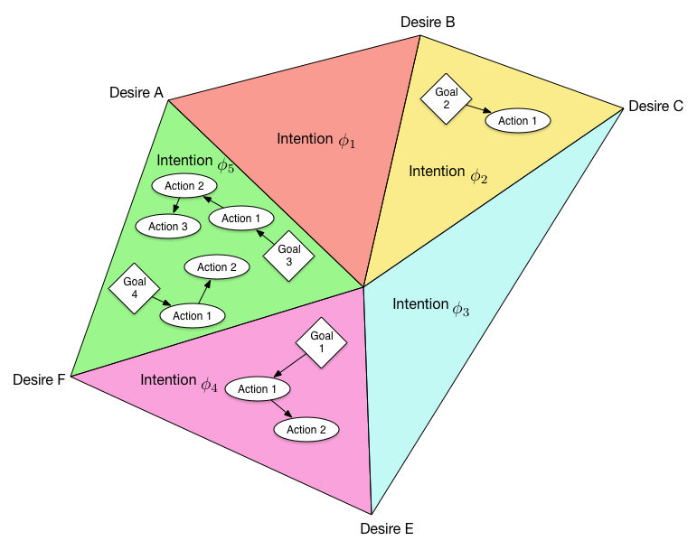

# Light-Jason - Lightwire version of AgentSpeak(L)

[](https://circleci.com/gh/flashpixx/Light-Jason)

Based on the project [Jason](http://jason.sourceforge.net/) by Jomi F. Hübner and Rafael H. Bordini
a Java 8 implementation has been created. The version defines an additional AgentSpeak grammar with
[AntLR](http://www.antlr.org/) and a fuzzy-based logical calculus and unification based on a mathematical
structure to describe an optimizing process.


## Requirements

* [JRE 1.8](http://www.java.com/)

### Development

* [JDK 1.8](http://www.oracle.com/technetwork/java/javase/downloads/)
* [Maven 3 or higher](http://maven.apache.org/)
* [Doxygen](http://www.doxygen.org/) with [GraphViz](http://www.graphviz.org/)


## Base Definitions

### <a name="belief">Beliefs</a>

* Beliefs implicitly describe the current state of the agent
* Beliefs will be updated before the cycle is run (beliefbase uses an update mechanism)
* Beliefs must be exists iif a expression is computed (beliefs can be exist on the fly)
* Belief addition triggers a plan with the definition ```+belief``` 
* Belief retraction triggers a plan with the definition ```-belief```
* If a literal of a belief is named equal to an [action](#action) the action will not be executed (store the value of the action within a variable, which is used within the belief literal)
* [Variables](#variable) within a belief literal will be unified before the belief is added to the beliefbase

### <a name="action">Actions</a>

* Actions will be run immediately
* Actions can fail (false) or succeed (true)
* There is no difference between internal and external actions
* Actions can be also a logical or assignment expression (these are always true)
* actions with ```@```-prefix wil be executed in parallel (each inner action will be run in parallel)


### <a name="plan">Plans</a>

* Plans are _sequences of [actions](#action), [rules](#rule) and/or achievement / test [goals](#goal)_
* Plans has got an optional context, that defines a constraint for execution (default is true and matches always)
* Plans fail iif an item of the plan fails
* Plans returns a boolean value which defines fail (false) and success (true)
* Plans run items in sequential order on default
* If the plan calls an _achievement [goal](#goal) addition_, the [goal](#goal) is added to the global [goal](#goal) list and the current plan is paused until the goal is reached
* If the plan calls an _achievement [goal](#goal) deletion_, the [goal](#goal) is removed from the global [goal](#goal) list iif exists and returns true otherwise it returns false and the plan can fail
* All items results will be concatenated with a logical _and_ to calculate the plan result value
    
#### <a name="planinternal">Internals Constants</a>
 
* The plan has got additional [constant variables](#variable), that are added in the context condition (values are calculated before plan execution is started)
    * _Score_ returns the current score-value of the plan
    * _Failrun_ stores the number of fail runs
    * _Successrun_ stores the number of successful runs
    * _Runs_ number of runs of the plan (fail + successful runs)
    
#### <a name="fuzzy">Fuzziness</a>

* Fuzzy value must be in [0,1]
* Each plan can use the annotation _fuzzy_ to create a fuzzy-plan, if not value is given, the value is set to 1 (exact)
* Each [action](#action) in a fuzzy-plan returns also a fuzzy value to define the fuzziness
* The [plan](#plan) or [rule](#rule) result returns true / false and the aggregated fuzzy value
* If a test or achievement [goal](#goal) is called it triggers all [plans](#plan) which are matched by the calculated fuzzy value


### <a name="rule">Rules</a>

* Rules are similar to [plans](#plan) without the context condition
* Rules cannot be triggered by a goal, so they must be called from a plan
* Rules run immediatly
* Rules run sequentially on default
* Rules returns a boolean value which defines fail (false) and success (true)
* All items results will be concatinate with a logical _and_ to calculate the plan result value
* [Variables](#variable) will be unified

### <a name="annotation">Rule / Plan Annotation</a>

* Annotations can modify a plan / rule behaviour to change runtime semantic
* The following annotation can be used
    * ```@Fuzzy``` sets the [fuzzy value](#fuzzy)
    * ```@Score``` adds an individual score value
    * ```@Expires``` defines a belief which stops the [plan](#plan) execution immediatly
    * ```@Atomic``` the plan / rule cannot be fail, it returns always true (only the [actions](#action) can fail)
    * ```@Exclusive``` no other [plan](#plan) / [rule](#rule) will run simulaneously
    * ```@Parallel``` all items will be run in parallel

 
### <a name="goal">Goals</a>

* Semantically a goal marks a certain state of the world an agent _wishes to bring about_ [AgentSpeak, p.40]
* New/Removed goals, i.e. _achievement goals_ trigger an _achievement goal addition/deletion_ which leads to the execution of a corresponding [plan](#plan)
* On agent start, there can exists one _initial goal_ only (like the ```main``` function in Java, C/C++)
* Each agent can track _more than one goal_ otherwise the agent is idles (the suspending state is not used)
* Goals are triggered by external events which will match by the goal name
* Goals will be resolved into [plans](#plan) with equal name (and allowed context), the [plan](#plan) is the intantiiation of the goal
* Goals are run in parallel independed from other goals
* A goal is a sequence of [plans](#plan) which must all finished successfully
* A goal is part of exactly one [intention](#intention)
* if a goal can match a [desire](#desire) (the goal is near to the desire) it can add an event to match the desire [belief](#belief)

#### <a name="testgoal">Test Goals</a>

* A test goal is a literal with the definition ```?literal``` 
* The test return true iif a plan with an equal literal is within the current execution (current running or supsending)


### <a name="intention">Intentions</a>

* An intention is the _convex hull_ of its [goals](#goal)
* The intention is set of of goals, which must exist simultaneously 
* Intentions cannot be in conflict with other intentions, so there dies not exists any overlaping

### <a name="desire">Desires</a>

* A Desire is a vertex of the edge of all intentions
* Desires are defined by a set of beliefs
* Desires can be in conflict with other desires, represented that the desires have got a large distance (much as possible) 
* The desire is successfully reached, iif all beliefs are existing anytime

### <a name="variable">Variables</a>

* Variables are written with an upper-case letter at begin
* Thread-safe variables for parallel runtime start with ```@``` (at-sign) followed by an upper-case letter

### <a name="buldinaction">Build-in Actions</a>

#### Math

* min / max
* sin / cos / tan / exp
* frac / round / ceil / abs / sgn
* BLAS structure & algorithms
* random generators (uniform, normal, pareto, beta, bernoulli, ...)

#### String

* concat / substring / reverse
* upper / lower
* beginswith / endswith
* count / length

#### List

* get / add
* concat
* replace / sublist / reverse / delete
* empty / count
* has
* difference / union / sort / range

#### Date / Time

* date / time / datetime / datetimeutc
* datedifference / timedifference

#### Cryptographic

* hash algorithms (md-?, sha-?, ...)
* signature algorithm
* encryption algorithms

#### Web-Access

* HTTP(s) client
* REST-API client
* SOAP client


## <a name="graphic">Graphical Representation</a> 




## Coding

### Agent

* Agent (ASL) can be defined as a logic program with [beliefs](#belief), [rules](#rule) and [plans](#plan)
* Agents must be run (triggered) by an external runtime e.g. from an outside system component
* [Plans](#plan) can be bundeled in a _plan-bundle_ which is semantic equal to a class, plan-bundles can be included in an agent


## Running Semantics

### <a name="cycle">Agent-Cycle</a>

Semantik definition of Jason see chapter 10.1 [AgentSpeak, p.207]

1. run update beliefbase
    * write waiting / marked beliefs into the beliefbase
    * generate beliefbase events

2. if agent is in suspend state
    * check wake-up goal iif match, wake-up agent otherwise stop execution
    
3. run agent cycle

    1. collect plans, which match the belief-events
    2. collect plans, which match the goal-events
    3. create plan execution list of _earmarked executing plans_ and _collected plans_
    4. execute collected plans in parallel and apply the following rules for each body formula

        1. if an item is an _action_ or _rule_ execute it immediatly
        2. if an item is a _test goal_ check instantiated plans if a plan is found return true otherwise false
        3. if an item is an _achievment goal_ and
            * begins with ```!``` add it to the _earmarked executing plans list_ and set the current plan to _waiting state_
            * begins with ```!!``` the plan which is matched by the goal is executated immediately within the current plan context          
        4. if an item is a belief-
            * addition, mark the literal for adding into the beliefbase
            * deletion, mark the literal for removing from beliefbase
            * changing, mark the literal with changes for update within the beliefbase

    5. if a plan is finished check plan towards the _waiting state plan list_ and move waiting plans to the _earmarked executing plans list_
        * if the plan fails create a ```-!goal``` event 

4. increment cycle value

### <a name="buildinbelief">Build-in Beliefs</a>

* ```my/cycle``` current agent cylce, generates no event
* ```my/awake``` exists when the agent is resumed from suspending, generate ```+``` event in cycle t and ```-``` event in cycle t+1 with value of suspended cycles
* ```my/size/beliefbase``` number of beliefs within the current beliefbase, generates no event
* ```my/size/planbase``` number of plans, generates no event
* ```my/current/plans/``` planname with state [pause|running] as string value


## Todos

* Beliefs:
    * (?) define annotations describing the origin/state/reason/... of a belief, including fixed ones like: _source_
    * (?) also non-fixed for _Mental Notes_
    * (?) -> needs grammar update beliefs, similar to ```atomic_formula```, but has to be be more like ```[ list ]``` (this would also allow nested annotations (see p. 38)
    * (see p. 37ff for comparison w/ Jason)
* parallel / SIMD unification with [type inhertitance](http://stackoverflow.com/questions/1396558/how-can-i-implement-the-unification-algorithm-in-a-language-like-java-or-c) or [Java Unification](https://code.google.com/p/kawala/source/browse/trunk/src/com/kaching/platform/common/types/Unification.java?r=265)
* expression grammar [AntLR](http://stackoverflow.com/questions/16469023/antlr-left-recursion-for-nesting-boolean-expressions), [C#](http://www.codeproject.com/Articles/18880/State-of-the-Art-Expression-Evaluation), [Expression Grammar](https://ivanyu.me/blog/2014/09/13/creating-a-simple-parser-with-antlr/)
* [ISO Prolog Specification](http://stackoverflow.com/questions/20119749/is-there-an-iso-prolog-reference-implementation)
* publish to [Maven central](http://stackoverflow.com/questions/14013644/hosting-a-maven-repository-on-github)
* visualization with [data mining toolbox](http://ifs.tuwien.ac.at/dm/)

